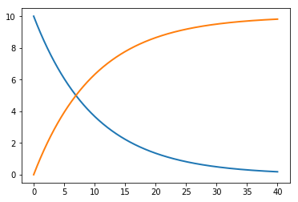

<h1>&nbsp;&nbsp;tellurium</h1>

[](https://travis-ci.org/sys-bio/tellurium)
[](http://tellurium.readthedocs.org/en/latest/)
[](https://zenodo.org/badge/latestdoi/16783593)
[](https://opensource.org/licenses/Apache-2.0)
[](https://badge.fury.io/py/tellurium)
[](https://badge.fury.io/gh/sys-bio%2Ftellurium)

Copyright 2014-2017
Kiri Choi, J Kyle Medley, Matthias König, Kaylene Stocking, Caroline Cannistra, Michal Galdzicki, and Herbert Sauro

## Introduction

Tellurium is a python environment for reproducible dynamical modeling of biological networks. 
Tellurium provides the interfacial code to convert between standard formats and utilize powerful 
libraries without requiring technical expertise, allowing you to focus on what’s important: 
building better models. Tellurium also provides first-class support for exchangeability via 
[COMBINE archives](http://co.mbine.org/documents/archive), allowing you to share your models 
and simulations with other tools.

Tellurium combines state-of-the-art scientific Python libraries, such 
as [NumPy](http://www.numpy.org/) and [SciPy](http://www.scipy.org/), 
and includes special-purpose systems biology Python tools. Out of the box, 
Tellurium includes [libroadrunner](https://github.com/sys-bio/roadrunner), 
[antimony](http://antimony.sourceforge.net/), [phrasedml](http://phrasedml.sf.net/), 
[libsbml](http://sbml.org/Software/libSBML), and [libsedml](https://github.com/fbergmann/libSEDML).

The Tellurium project is funded from the NIH/NIGMS (GM081070).

## Documentation 
* General: http://tellurium.readthedocs.org/en/latest/
* API: http://tellurium.readthedocs.io/en/latest/_apidoc/tellurium.html
* Webpage: http://tellurium.analogmachine.org/

## Usage Example

```{python}
import tellurium as te

rr = te.loada('''
    model example0
      S1 -> S2; k1*S1
      S1 = 10
      S2 = 0
      k1 = 0.1
    end
''')

result = rr.simulate(0, 40, 500) 
te.plotArray(result)
```



## Installation Instructions

Tellurium can either be installed with a front-end (Notebook, IDE) or as a Python package:

A. [Notebook front-end](#front-end-1-tellurium-notebook)  
B. [IDE front-end](#front-end-2-tellurium-spyder-ide) based on [Spyder2](https://github.com/spyder-ide/spyder)  
C. [Python package (pip)](#install-via-pip-no-front-end)

We recommend first-time users choose one of the front-ends, while developers looking to integrate Tellurium use the pip package. 
The IDE front-end provides a MATLAB like experience with a code editor and Python console. 
The notebook front-end provides a notebook interface similar to [Jupyter](http://jupyter.org/), 
and features notebook cells for inline OMEX, a human-readable representation of COMBINE archives.

-------

### Front-end 1: Tellurium Notebook
The Tellurium notebook supports Windows 10, Mac OS X 10.10+, Debian 8+, and Fedora 22+.
The notebook viewer comes with Python 3.6 (64-bit).


<h4>Windows</h4>
<br style="clear:both"/>

1. [Download Tellurium Notebook for Windows](https://sourceforge.net/projects/pytellurium/files/notebook/Tellurium%20Setup%202.0.13.exe/download)
2. Double-click the installer `*.exe` to start the installation
3. Follow the instructions


<h4>Mac OS X</h4>
<br style="clear:both"/>

1. [Download Tellurium Notebook for Mac OS X 10.10 or later](https://sourceforge.net/projects/pytellurium/files/notebook/Tellurium-2.0.12.dmg/download)
2. You may need to [disable Gatekeeper](https://github.com/sys-bio/tellurium/wiki/FAQ#on-mac-after-downloading-tellurium-i-cant-open-it-because-it-is-from-an-unidentified-developer)
3. Double-click the `*.dmg` file to open a new window
4. Drag the Tellurium icon to your Applications
5. You can now launch Tellurium from Spotlight or directly from your applications folder


<h4>Linux (RedHat)</h3>
<br style="clear:both"/>

1. [Download Tellurium Notebook (.rpm)](https://sourceforge.net/projects/pytellurium/files/notebook/Tellurium-2.0.12.rpm/download)
2. Install the package using `dnf install Tellurium-2.0.12.rpm`
3. You should be able to launch Tellurium from your activities pane. If not, log out and in again or run `tellurium` from the terminal.


<h4>Linux (Debian)</h4>
<br style="clear:both"/>

1. [Download Tellurium Notebook (.deb)](https://sourceforge.net/projects/pytellurium/files/notebook/Tellurium_2.0.12_amd64.deb/download)
2. Install the package using `dpkg -i Tellurium_2.0.12_amd64.deb`
3. You should be able to launch Tellurium from your activities pane. If not, log out and in again or run `tellurium` from the terminal.

<br>

:question:Looking for old releases? [You can find them here.](https://sourceforge.net/projects/pytellurium/files/notebook)

<br>

-------

### Front-end 2: Tellurium Spyder IDE
The Spyder IDE installers are tested with Windows 7+ and Mac OS X 10.9+. Some older Macs cannot run Spyder, regardless of 
whether the operating system is up-to-date. 
The IDE comes with Python 2.7 (64-bit).


<h4>Windows</h4>
<br style="clear:both"/>

1. [Download Tellurium IDE for Windows](https://sourceforge.net/projects/pytellurium/files/Tellurium-2.0/2.0.12/Tellurium-2.0.12-Python-2.7-win64-portable-setup.exe/download)
2. Double-click the installer to start the installation
3. Follow the instructions

NOTE: Installation requires administrative rights. It is recommended to accept the default settings.


<h4>Mac OS X (Legacy)</h4>
<br style="clear:both"/>

Currently, only a legacy version of the Mac Spyder IDE is available. We recommend using the Notebook front-end on Mac.


1. [Download Tellurium IDE for Mac OS X 10.10 or later](https://github.com/sys-bio/tellurium/releases/download/1.3.5-rc3/Tellurium-1.3.5-Spyder-2.3.8-OSX.dmg)
2. Double-click the .dmg file to open a new window
3. Double-click the Spyder icon

-------

### Install via pip (no front-end)
[](https://badge.fury.io/py/tellurium)

Binary pip packages for Tellurium are available from PyPi and support 64-bit Python versions 2.7, 3.5, and 3.6 for Windows, Mac, and Linux.
Pip packages are tested on Fedora 22, Debian 8, Ubuntu 14.04, and Mac OS X 10.10.

The latest package release can be installed via
```
pip install tellurium
```
The latest stable version from the repository can be installed via
```
pip install git+https://github.com/sys-bio/tellurium.git
``` 

## Legal

The source code for the Tellurium Python package is hosted at https://github.com/sys-bio/tellurium and is licensed under the [Apache License, Version 2.0](http://www.apache.org/licenses/LICENSE-2.0). Tellurium uses third-party dependencies which may be licensed under different terms. Consult the documentation for the respective third-party packages for more details.

TELLURIUM AND ALL SOFTWARE BUNDLED WITH TELLURIUM (HEREAFTER "THE SOFTWARE") IS PROVIDED BY THE COPYRIGHT HOLDERS AND CONTRIBUTORS "AS IS" AND ANY EXPRESS OR IMPLIED WARRANTIES, INCLUDING, BUT NOT LIMITED TO, THE IMPLIED WARRANTIES OF MERCHANTABILITY AND FITNESS FOR A PARTICULAR PURPOSE ARE DISCLAIMED. IN NO EVENT SHALL THE COPYRIGHT HOLDERS OR ANYONE DISTRIBUTING THE SOFTWARE BE LIABLE FOR ANY DIRECT, INDIRECT, INCIDENTAL, SPECIAL, EXEMPLARY, OR CONSEQUENTIAL DAMAGES (INCLUDING, BUT NOT LIMITED TO, PROCUREMENT OF SUBSTITUTE GOODS OR SERVICES; LOSS OF USE, DATA, OR PROFITS; OR BUSINESS INTERRUPTION) HOWEVER CAUSED AND ON ANY THEORY OF LIABILITY, WHETHER IN CONTRACT, STRICT LIABILITY, OR TORT (INCLUDING NEGLIGENCE OR OTHERWISE) ARISING IN ANY WAY OUT OF THE USE OF THE SOFTWARE, EVEN IF ADVISED OF THE POSSIBILITY OF SUCH DAMAGE.
